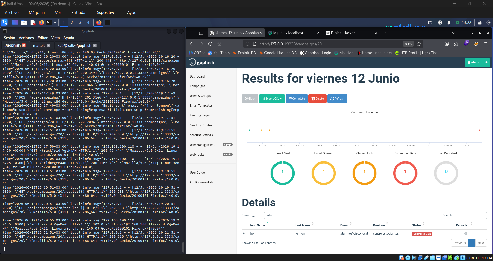
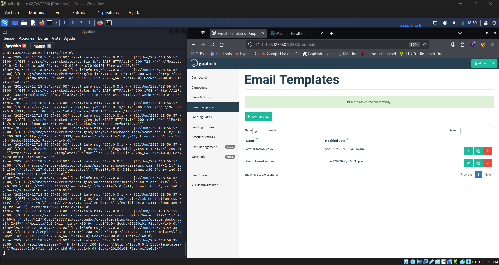
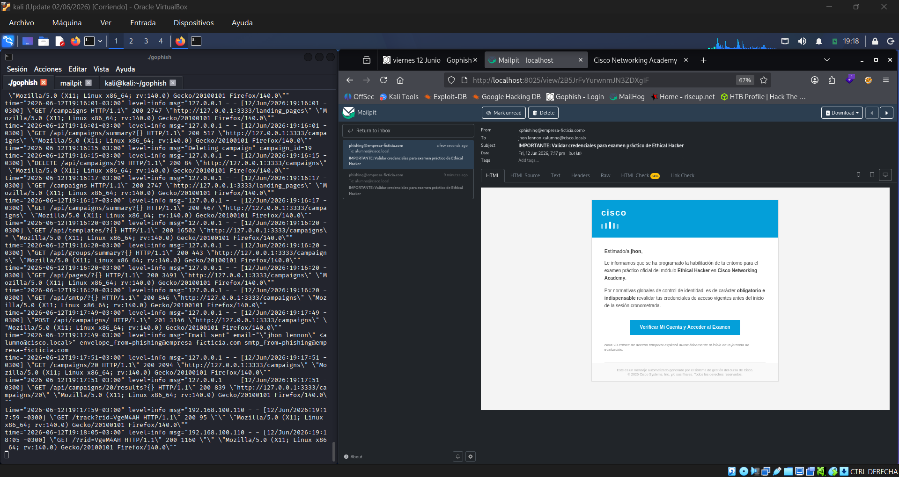
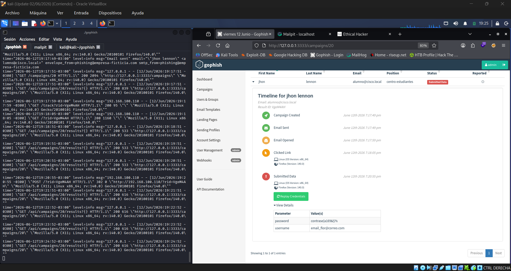

# 🎣 Gophish Lab


## 📌 Descripción

Laboratorio práctico de simulación de phishing desarrollado con **GoPhish** y **Mailpit** en un entorno controlado de laboratorio.

El objetivo del proyecto es comprender el ciclo completo de una campaña de ingeniería social desde una perspectiva defensiva y educativa, documentando la creación de plantillas, páginas de aterrizaje, perfiles SMTP y análisis de resultados.

> ⚠️ Este laboratorio fue realizado exclusivamente con fines educativos y de concientización en ciberseguridad.

---

## 🛠️ Tecnologías utilizadas

* 🐉 Kali Linux
* 🎣 GoPhish
* 📬 Mailpit
* 🌐 HTML
* 📝 Markdown
* 🔧 Git
* 🐙 GitHub

---

## 🎯 Objetivos del laboratorio

* Mostrar el funcionamiento de GoPhish.
* Diseñar campañas de concientización.
* Crear plantillas de correo personalizadas.
* Implementar páginas de captura simuladas.
* Analizar métricas de interacción.
* Documentar hallazgos y recomendaciones defensivas.

---

## 📂 Estructura del proyecto

```text
Gophish-Lab/
│
├── screenshots/
├── report/
├── templates/
├── campaign/
├── config/
└── README.md
```

---

## 📸 Evidencias del Laboratorio

### 01 — Dashboard GoPhish — Métricas en tiempo real

> Campaña "Viernes 12": Email Sent ✅ · Opened ✅ · Clicked ✅ · Submitted ✅

---

### 02 — Editor de Email Template HTML

> Template con branding Cisco construido en HTML puro con variables GoPhish: `{{.FirstName}}` y `{{.URL}}`.

---

### 03 — Email phishing renderizado en Mailpit

> Branding Cisco con SVG inline. Personalización activa: "Estimado/a jhon,"
> Header azul #049fd9, CTA button, footer con copyright Cisco 2026.

---

### 07 — Timeline forense + Credenciales capturadas

> Ciclo completo cerrado. Tiempo total del ataque: **3 minutos 6 segundos**.

| Evento | Timestamp | Delta |
|---|---|---|
| Email Sent | 7:17:49 pm | baseline |
| Email Opened | 7:17:59 pm | +10 seg |
| Clicked Link | 7:18:05 pm | +16 seg |
| Submitted Data | 7:20:55 pm | +3 min 6 seg |

> OS detectado automáticamente: Linux x86_64 · Firefox 140.0

---

## 📊 Resultados de la Campaña

| Métrica | Resultado |
|---|---|
| Email Sent | 1 / 1 (100%) |
| Email Opened | 1 / 1 (100%) |
| Clicked Link | 1 / 1 (100%) |
| Submitted Data | 1 / 1 (100%) |
| Tiempo hasta compromiso | 3 min 6 seg |
| Detección por el target | 0 |

---

## 📚 Aprendizajes

* Diseño de campañas de phishing controladas.
* Configuración de perfiles SMTP.
* Creación de landing pages.
* Análisis de resultados.
* Buenas prácticas de concientización.

---

## ⚖️ Aviso ético

Este repositorio tiene fines exclusivamente educativos, de laboratorio y capacitación en ciberseguridad. No se promueve el uso indebido de las herramientas documentadas.
